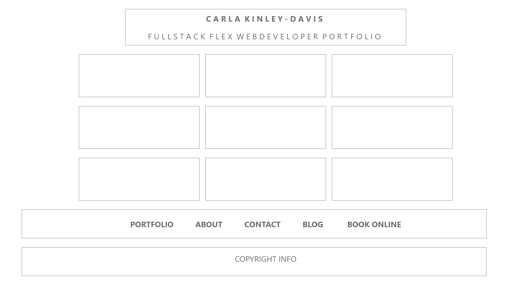

# KINLEYDAVIS Portfolio

Mrs. Davis is an active learner — In March 2020 she completed 60-hours of active, case-based learning on the fundamentals of financial accounting through Harvard Business School. Mrs. Davis is currently fulfilling the requirements of a six-month coding bootcamp through The Ohio State University to be completed in 2021.

The following project is a work in progress. To view a live representation please click <a href="https://ckinleydavis.github.io/portfolio/" target="_blank">here</a>.

## Wireframe

  

